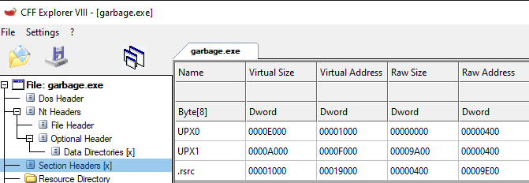
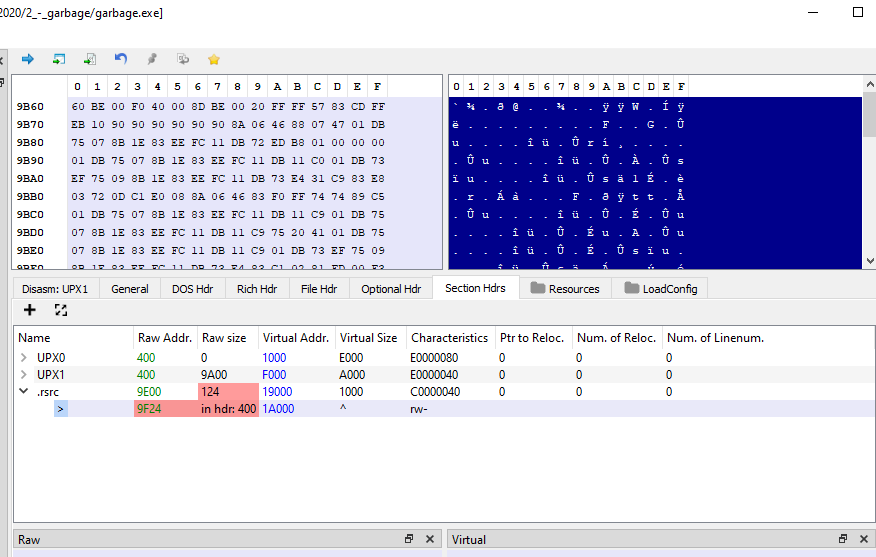
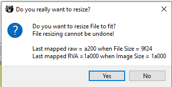
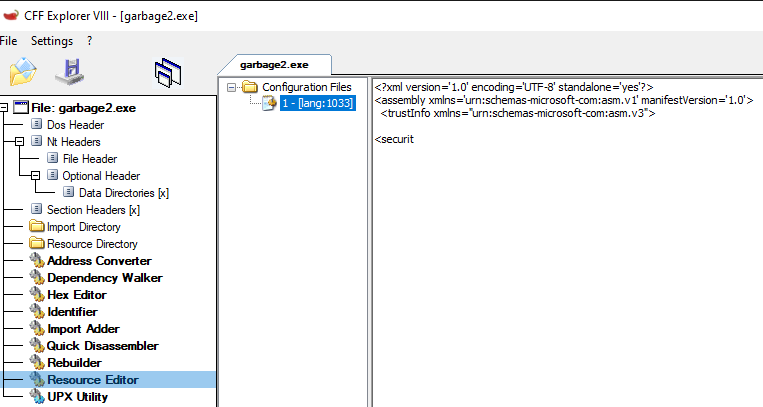
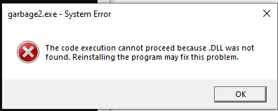
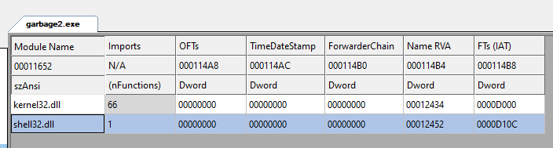
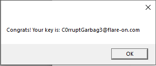

# start
> Looking for the flare-on challenges? Click [here](https://flare-on.com/files/Flare-On7_Challenges.zip)
> 
> Looking for solutions? FireEye has the [solutions](https://www.fireeye.com/blog/threat-research/2020/10/flare-on-7-challenge-solutions.html)

Flare-on challenge 2 involves a forensically recovered file that is in an unusable state. The goal here is to repair the file so it can be ran in order to retrieve the flag.

# alignment and corruption
Since the file cannot be ran, I was stuck doing static analysis initially. I used [CFF Explorer](https://ntcore.com/?page_id=388) to look a the file initially, and looking at the section headers revealed that the executable was packed by [UPX](https://upx.github.io/). 



Attempting to unpack the binary was unsuccessful and UPX gave an error.
```
upx -d garbage.exe
                       Ultimate Packer for eXecutables
                          Copyright (C) 1996 - 2020
UPX 3.96w       Markus Oberhumer, Laszlo Molnar & John Reiser   Jan 23rd 2020

        File size         Ratio      Format      Name
   --------------------   ------   -----------   -----------
upx: garbage.exe: OverlayException: invalid overlay size; file is possibly corrupt

Unpacked 1 file: 0 ok, 1 error.
```

Since the challenge suggested the file was corrupt, this is not a big surprise but it was worth trying anyway. The next step is to look for a way to purify the file of its corruption.

I opted to use a tool called [PE-bear](https://hshrzd.wordpress.com/pe-bear/) to further analyze the file. PE-bear shows that there's an error with the `.rsrc` section of the binary and other issues in the optional header section. Clicking the align button in PE-bear shows that the raw size of the file is not what's expected by the binary, so you can accept the changes and then save a new copy of the binary to disk. After saving the file to the disk, UPX is able to unpack the file.





```
upx -d garbage.exe
                       Ultimate Packer for eXecutables
                          Copyright (C) 1996 - 2020
UPX 3.96w       Markus Oberhumer, Laszlo Molnar & John Reiser   Jan 23rd 2020

        File size         Ratio      Format      Name
   --------------------   ------   -----------   -----------
     96256 <-     58368   60.64%    win32/pe     garbage.exe

Unpacked 1 file.
```

However, the file still didn't want to run and causes an error to log out to Windows' event viewer. Opening the event viewer and looking for the error message for this application reveals the following message:
> Activation context generation failed for "C:\Users\rev\Documents\flare2020\2_-_garbage\garbage.exe".Error in manifest or policy file "C:\Users\rev\Documents\flare2020\2_-_garbage\garbage.exe" on line 3. Invalid Xml syntax.

New error messages means progress, right?

# a window and its resources
The error message references invalid XML syntax which seems odd considering that we're working with a binary file. The thing is, Windows executables usually include something called an [application manifest](https://docs.microsoft.com/en-us/windows/win32/sbscs/application-manifests) which is an XML formatted file. With this information, I opened the unpacked file up in CFF Explorer again and opened the resources that are referenced in the binary. There's a folder called "configuration files" and something simply labeled "1 - \[lang:1033\]". Clicking on the file shows a broken XML file.



Since I don't know what the manifest was supposed to look like, I did what anyone else would do and deleted it to see what would happen. I wept when my deleting plan didn't work, but I got new error messages again so more progress was had. 



# dlhell
The previous error shows missing DLLs, but like any good error message, it doesn't tell us what DLLs are actually missing. Navigating to the import directory shows that there are two DLLs that should be imported, but they aren't named. Luckily, clicking on the mystery libraries shows us functions related to said library. Off to the internet I went and searched for what libraries these functions were associated to and I found the first DLL was `kernel32.dll` and the second was `shell32.dll`. 



I saved the my changes and then ran the executable again and I finally got the flag.



# takeaways
An interesting challenge that taught me a bit more about how to fix a forensically recovered file and a bit more about the PE header in practice. 
